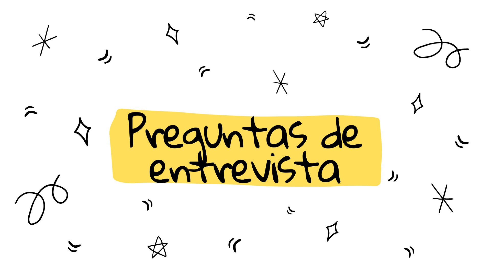

 
  

  
  
  
   
¡Hola!👋 He creado esta guía con preguntas que he recopilado en internet para prácticar antes de una entrevista (de Junior Front-End Developer, para ser más específica!). Si tienes alguna propuestas o sugerencia, no dudes en contactarme!🤸‍♀️

  <h3 align="left">Tabla de contenidos</h3>

 <ul align="left">
   <!-- <li><a href="./HTML/PreguntasHTML.md">HTML</a></li>
   <li><a href="./CSS/PreguntasCSS.md">CSS</a></li> -->
   <li><a href="./JavaScript/PreguntasJavaScript.md">JavaScript</a></li>
   <li><a href="./Ejercicios de código/EjerciciosPracticos.md">Ejercicios de Código</a></li>
    <li>Y continuará...</a></li>
 </ul>

